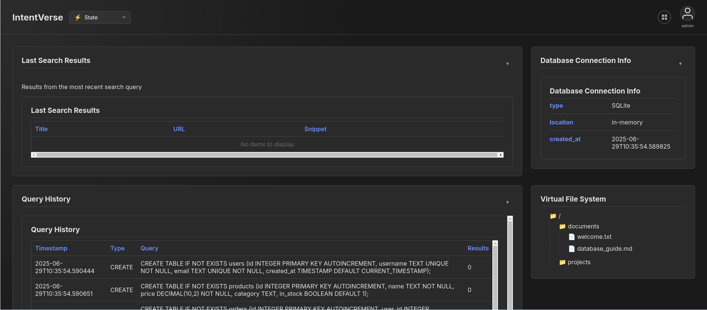

# IntentVerse


**IntentVerse is a dynamic, open-source AI MCP tool sandbox. It provides a safe and observable environment for developing, testing, and understanding AI agent/MCP tool interactions.**

## The Problem

As AI agents become more powerful, they need to interact with external tools like file systems, email, and web browsers to accomplish complex tasks. However, testing these agents presents a significant challenge:

* **Safety:** You cannot let an untested AI agent run loose on your real file system or email account.
* **Observability:** It's difficult to understand *what* an agent is trying to do. Logs of API calls are abstract and don't show the *consequences* of the agent's actions.
* **Reproducibility:** Setting up consistent, stateful testing environments is complex and time-consuming.

## Solution

IntentVerse solves these problems by creating a high-fidelity mock environment. It's a "padded room" for your AI, with a one-way mirror for you to watch through.

* **Safe Simulation:** IntentVerse exposes a suite of mock tools (like a virtual file system and email client) to your AI. The AI can write files, send emails, and perform other actions, but it's all safely contained within the simulation.
* **Visual Observability:** A clean, intuitive web interface shows you the *consequences* of your agent's actions in real-time. See the files being created, the emails being sent, and a human-readable audit log of every decision.
* **Dynamic & Modular:** Easily add new custom tools to the sandbox. The UI dynamically adapts to show your new tools without any frontend code changes.

---

### Screenshot


---

## Key Features

* **Secure User Authentication:** Standard JWT-based authentication for the web interface.
* **Schema-Driven UI:** A fully dynamic interface that renders based on the modules you have installed.
* **MCP Compliant:** Uses the standard Model Context Protocol (MCP) for communication with AI models.
* **Core Modules:** Comes with pre-built **File System**, **Email** and **Memory** modules.
* **Pluggable Tools:** Designed from the ground up to be modular and extensible.
* **External Logging:** Emits structured logs for easy integration with any observability platform.

## Getting Started

IntentVerse can be run in multiple ways depending on your needs. Choose the method that works best for your environment.

### System Requirements

- **Operating System:** Linux, macOS, or Windows
- **Memory:** 2GB RAM minimum, 4GB recommended
- **Storage:** 1GB free disk space
- **Network:** Internet connection for initial setup and AI model integration

### Quick Start with Docker (Recommended)

The fastest way to get IntentVerse running is with Docker Compose, which handles all dependencies and service orchestration automatically.

#### Prerequisites
- [Docker](https://docs.docker.com/get-docker/) (version 20.10 or later)
- [Docker Compose](https://docs.docker.com/compose/install/) (included with Docker Desktop)
- [Git](https://git-scm.com/downloads)

#### Installation Steps

1. **Clone the repository:**
   ```bash
   git clone https://github.com/ngardiner/IntentVerse.git
   cd IntentVerse
   ```

2. **Start all services:**
   ```bash
   docker compose up --build
   ```

3. **Access the application:**
   - **Web Interface:** http://localhost:3000
   - **Core API:** http://localhost:8000 (API docs at http://localhost:8000/docs)
   - **MCP Server:** http://localhost:8001

4. **Default Login:**
   - Username: `admin`
   - Password: `IntentVerse`

5. **Verify Installation:**
   ```bash
   # Check that all services are healthy
   docker compose ps
   
   # You should see all services as "healthy"
   ```

#### Stopping the Application
```bash
# Stop services (Ctrl+C if running in foreground, or:)
docker compose down
```

### Local Development Setup

For development work or if you prefer to run services natively:

#### Prerequisites
- Python 3.11+ with pip and venv
- Node.js 18+ with npm
- curl (for health checks)

#### Quick Start
```bash
# Clone and start all services
git clone https://github.com/ngardiner/IntentVerse.git
cd IntentVerse
./start-local-dev.sh
```

This script automatically:
- Creates Python virtual environments
- Installs all dependencies
- Starts all three services with hot reloading
- Shows live logs from all services

#### Manual Setup
If you prefer to run services individually:

1. **Start Core Service (Terminal 1):**
   ```bash
   cd core
   python3 -m venv venv
   source venv/bin/activate  # On Windows: venv\Scripts\activate
   pip install -r requirements.txt
   uvicorn app.main:app --host 127.0.0.1 --port 8000 --reload
   ```

2. **Start MCP Service (Terminal 2):**
   ```bash
   cd mcp
   python3 -m venv venv
   source venv/bin/activate  # On Windows: venv\Scripts\activate
   pip install -r requirements.txt
   CORE_API_URL=http://127.0.0.1:8000 python -m app.main
   ```

3. **Start Web Service (Terminal 3):**
   ```bash
   cd web
   npm install
   npm start
   ```

#### Stopping Local Development
```bash
# Use the provided script
./stop-local-dev.sh

# Or press Ctrl+C in each terminal
```

### Using with AI Models

IntentVerse implements the Model Context Protocol (MCP) for seamless integration with AI models and frameworks. The MCP Interface supports two running modes:

- **HTTP Mode (Default):** Persistent server for remote connections and multiple clients
- **Stdio Mode:** Ephemeral process for local, single-session interactions

#### Claude Desktop Integration

For Claude Desktop, use stdio mode with this configuration:

```json
{
  "mcpServers": {
    "intentverse": {
      "command": "docker",
      "args": [
        "run", "-i", "--rm", 
        "--network", "intentverse-net", 
        "intentverse-mcp", 
        "python", "-m", "app.main", "--stdio"
      ]
    }
  }
}
```

**Prerequisites:**
- IntentVerse must be running: `docker compose up`
- Images must be built: `docker compose build`

#### Generic MCP Client Integration

**HTTP Mode (Multiple Clients):**
```bash
# Connect to persistent server
curl -X POST http://localhost:8001/ \
  -H "Content-Type: application/json" \
  -d '{"jsonrpc": "2.0", "id": 1, "method": "tools/list"}'
```

**Stdio Mode (Single Session):**
```bash
# Local development
cd mcp && python -m app.main --stdio

# With Docker
docker run -i --rm --network intentverse-net intentverse-mcp --stdio
```

For detailed mode documentation, see [docs/mcp/mcp-modes.md](docs/mcp/mcp-modes.md).

#### Testing Both Modes

Verify that both modes work correctly:

```bash
# Quick test of both modes
python test_mcp_modes.py

# Comprehensive pytest-based tests
cd mcp && python run_mode_tests.py
```

See [docs/testing-mcp-modes.md](docs/mcp/testing-mcp-modes.md) for detailed testing information.

### Troubleshooting

#### Port Conflicts
If you encounter port conflicts, check what's using the ports:
```bash
# Check if ports are in use
lsof -i :3000  # Web service
lsof -i :8000  # Core service
lsof -i :8001  # MCP service
```

#### Docker Issues
```bash
# Clean up Docker resources
docker compose down -v
docker system prune -f

# Rebuild from scratch
docker compose build --no-cache
docker compose up
```

#### Local Development Issues
```bash
# Reset local environment
./stop-local-dev.sh
rm -rf core/venv mcp/venv web/node_modules
./start-local-dev.sh
```

#### Service Health Checks
```bash
# Check if services are responding
curl http://localhost:8000/     # Core API
curl http://localhost:8001/     # MCP Server
curl http://localhost:3000/     # Web Interface
```

### What You Get

After installation, IntentVerse provides:

- **Web Dashboard:** A real-time view of all AI agent activities
- **Mock Tools:** Pre-configured file system, email, memory, database, and web search tools
- **Sample Data:** Ready-to-use content for immediate testing
- **MCP Server:** Standards-compliant interface for AI model integration
- **Content Packs:** Shareable configurations and scenarios

### Next Steps

1. **Explore the Interface:** Log in to the web interface and explore the pre-loaded sample data
2. **Try Content Packs:** Import/export content packs to share configurations
3. **Connect an AI Model:** Use the MCP interface to connect your favorite AI model
4. **Read the Documentation:** Check out the [docs/](docs/) directory for detailed guides

For more detailed setup instructions, see [docs/installation.md](docs/installation.md).
